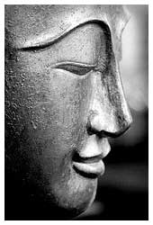

A few months ago I got an interesting note in a fortune cookie. It read, "Hold onto your most cherished dreams." As usual, this fortune was authored as a generality and therefore would apply to most anyone but for some reason it really stuck with me. And the questions I started asking myself were, "what **are** my most cherished dreams?" and "how would I prioritize them?"

I wrote, re-wrote and then re-wrote them again. Only after a few weeks was I happy with the results. So while I know I need to get better in directing my daily habits and actions to achieve them at least now I have a list:

1. Be at peace with my healthy body, calm mind and charitable soul
2. Raise responsible, caring and inspired children
3. Enjoy loving relationships while living in a warm, nurturing home
4. Blissfully wonder in experiencing the beauty and mystery of creation
5. Have prosperous, invigorating work that leaves a positive impact

Being at the top of the list, my most cherished dream is to be at peace. I need to have a healthy body to chase my dreams so I need to exercise, eat well and (occasionally) get plenty of sleep. I need to keep an uncluttered mind and strive to be calm and emotively disconnected with the outcome of events in my life. What will be, will be. I also need to find ways to soulfully respond to events and challenges in my life in a kind and loving way that helps others.

Certainly as a father I want my kids to be happy, but I also want them to grow into respectable adults. I think to do that they need to be responsible, learn empathy for others and find something they are passionate about. I am a firm believer that much of this world's sadness comes from people who don't pursue their own dreams and passions. Like the saying goes, do what you love and you'll never work another day of your life.

It is important to have caring relationships to encourage and care for us on our journey through life. Healthy ones go both ways as friends carry you a few steps after you've carried them. For much of my life I've felt home has been too hectic and seclusive. My habits contribute to the current state of affairs and I know why my life was like that when I was younger.

Finally I want to have impactful work for my days. I'm trying to use the term "work" generically but yes, I also mean the work for which I draw a salary. I believe my skills are mixed in a rare and valuable way so I hope I can find fiscal prosperity. My work should challenge my thinking, my skills, push me and help me grow nearly every day – and not just in the obvious ways but also put me into situations that push me out of my comfort zone and into a better understanding of my life. All this, while looking to make a positive lasting impact. I'm not so sure dedicating my life to an I.P.O. moment makes the impact I'd like to leave. This is not judgmental, simply my view of the type of footprints I want to leave when I'm gone.

So there's my list. What's yours? I know it's a rough one and I've got some work to do, but even at 45 it's okay to have dreams, right?
