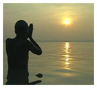

As many of you know, for the past 20 or so years I've been enjoying an nice career in the technology industry. Nice stops at the Bluetooth SIG, Apple, Intel, Iomega, iModules and few other startups along the way. It has been a fantastic time and I have been fortunate to have a knack for something that also pays relatively well.

Since I was in my late 20's I had always dreamed of my turn as the founder of a high-tech startup. It was going to be my fast ride on the big IPO/buyout fantasy of "never having to work again" – unless I wanted to. Over the past 4-5 years I have come to the conclusion that this dream has passed me by while also growing disillusioned with the "toys for boys" mantra of new technology. Lord knows I love new gadgets, but catching the next big thing, in my analysis, has become little more than catching the wind. It is nothing.

About a year ago I was introduced to WaterPartners (water.org) through a good friend. During a laid back casual lunch we talked about the state of technology, social networking and the direction of online engagement. It was a good time and led to a fun proof of concept consulting project this past summer. I didn't realize it would open a new chapter for my professional, and hopefully personal, life.

On 13-Feb I will be starting a new position with WaterPartners leading their marketing and individual donor engagement efforts. I am humbled I've been given the opportunity to help them and terrified by the challenge. The folks there do fantastic work – my job will be simply to focus a lens on their accomplishments and energize a community to support the effort. If you haven't heard of them, WaterPartners delivers clean water projects in the developing world. We in the western world might find it difficult to imagine how desperate this issue is in places like Eastern Africa and rural India but it very tragic. As I learned more and more about their mission and philosophy, I could see how helping them would not only provide me new challenges but could also reshape my perspective on myself and others by doing something that matters.

Please don't mistake my story as being judgmental. We all have our life journeys. It is only because of my years of work in the tech market that I'm able to consider such an opportunity and certainly living in the midwest eases the transition. I've also been very lucky to work on some very cool products and technologies over my career so in hindsight I really didn't miss a thing. It's just time to start the next chapter of my life.

Keep an eye open to water issues over the coming few years. If I'm up to the challenge you won't have to look very hard, it will be coming to you.
