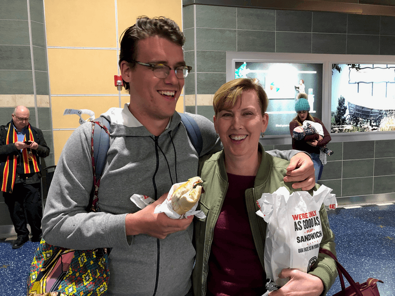

---

Title: Jodu
permalink: /jody
layout: page

---

My family and health are my most important priorities. For most of my career was an accountant until I was diagnosed with breast cancer in 2016. Following treatment I elected to restart my career in healthcare to service patients navigating many of the decision I had to make during my cancer journey. We laughed when our middle child Lucas returned home from his Peace Corps assignment in Rwanda. The first thing he wanted was a Jimmy Johns sandwich!

<a href="mailto:jody@mccamon.ong">Mail</a> ~ Peloton ~ Instagram ~ Facebook

***

## University of Kansas Cancer Center
### Certified Mastectomy Fitter  [ September 2019 to present]
- Consult with breast cancer patients on various prosthetic options
- Perform fittings and sizings
- Process patient paperwork following appointments
- Volunteer in Missys’ Boutique

## University of Kansas - Edwards Campus 
### Part time Accounting Specialist [January 2013 to September 2019]

* Code and process an average of 50 accounts payable invoices per month. 
* Process, track and reconcile $250,000 monthly in accounts receivable invoices for Continuing Education.
* Prepare $20,000 monthly in room rental and internal invoices.
* Monitor 15 departmental and employee purchasing cards.
* Reconcile and monitor balances of  Endowment accounts.
* Generate weekly bank deposits.
* Track outstanding accounts receivable for 2 departments, send initial collection letters.
* Assist Director of Finance with special projects.

## Heritage Christian Academy 

### Part time Bookkeeper [March 2010 to January 2013]
* Assist with accounts payable. 
* Process accounts receivable.
* Generate weekly bank deposits.
* Prepare and process tuition agreements for 450 students using MS Excel and track payments.
* Track donations and prepare thank you letters for donations using MS Word.

## Uniforms Direct 
### Part time Account Representative [October 2005 to October 2010]

* Handle sales of medical uniforms from order to delivery.
* Process an average of 90 orders per month. 
* Maintain inventory levels.
* Prepare sales and inventory reports on a monthly basis in Excel.

## Clark & Pruett, CPAs 
### Part time Tax Preparer [December 2003 to October 2005]
	
* Prepare individual tax returns for partner review.
* Assist with small business tax returns.
* Assist with bookkeeping for clients including QuickBooks data entry and bank reconciliations as needed.
* Prepare W-2s and 1099s.

## Education

- Wichita State University, Master of Business Administration	
- Wichita State University, Bachelor of Business Administration, Cum Laude	

